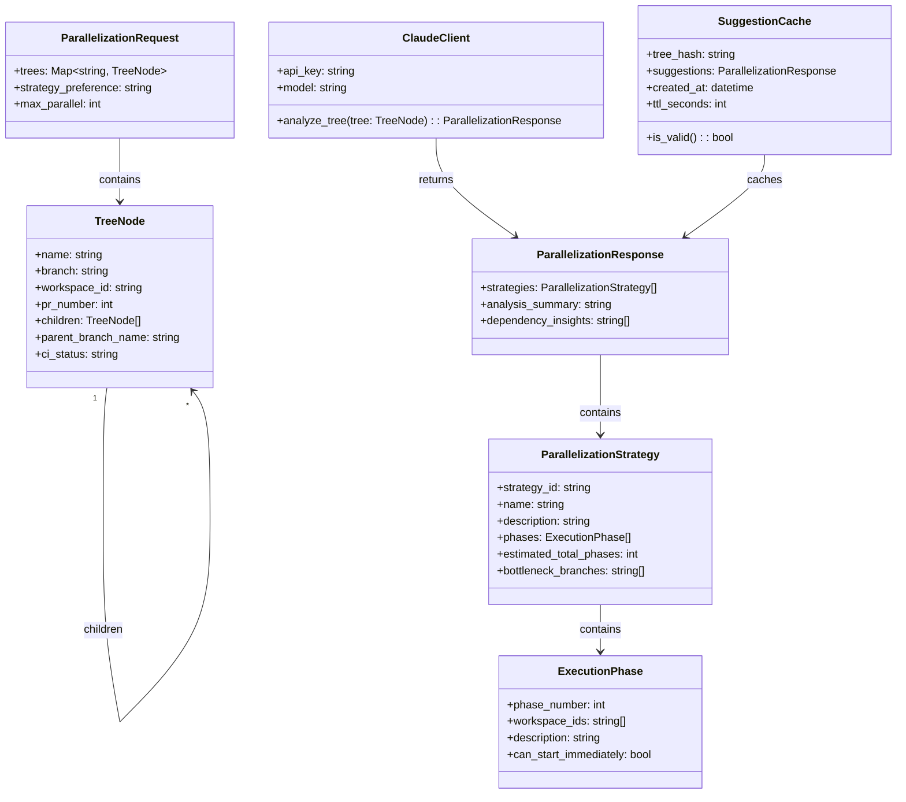
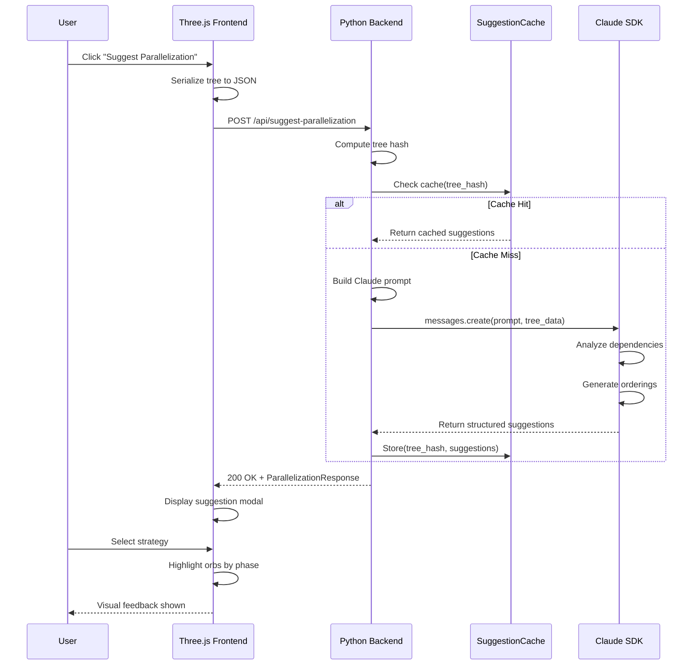
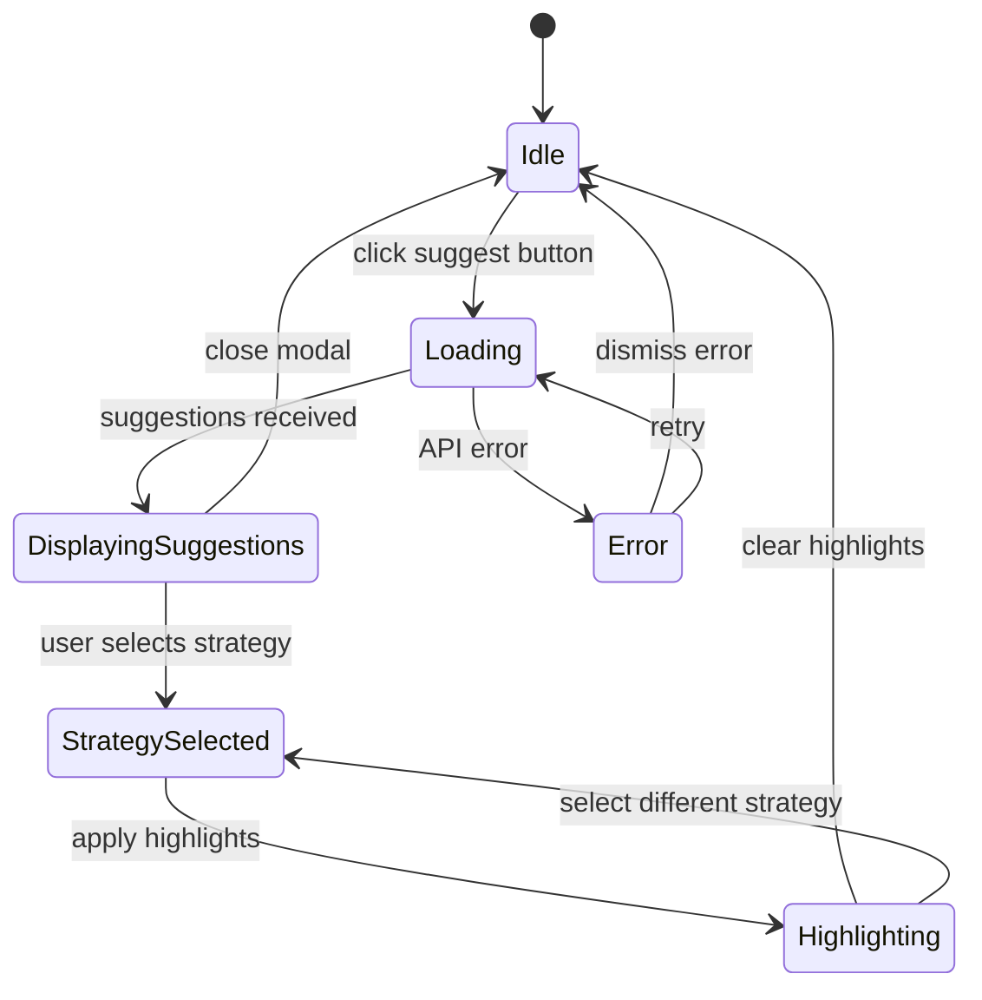
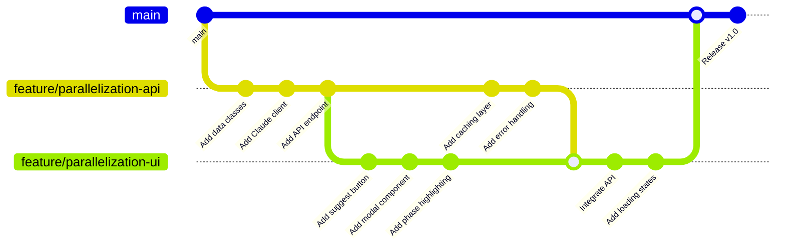

# Technical Spec: Orb Parallelization Suggestions

## 1. Background

### Problem Statement

Currently, the Conductor 3D Tracker visualizes workspace orbs in a hierarchical tree structure based on PR dependencies (stacked PRs). However, developers working with multiple parallel workspaces lack visibility into:

1. **Optimal task parallelization** - Which workspaces can be worked on simultaneously without blocking each other
2. **Dependency bottlenecks** - Which branches/PRs are blocking the most downstream work
3. **Execution ordering strategies** - Alternative ways to sequence work for different optimization goals (speed, risk reduction, CI efficiency)

When managing 5+ concurrent workspaces with complex PR stacking, developers make suboptimal decisions about which tasks to prioritize, leading to wasted time waiting for blocked dependencies.

### Context / History

- The Conductor 3D Tracker already builds a hierarchical tree structure from workspace/PR data (`build_hierarchy()` in `tracker_server.py:596-777`)
- Tree nodes contain parent-child relationships via `children` array and `parent_branch_name` field
- The Three.js frontend renders this hierarchy as 3D orbs with connecting lines
- No existing tooling suggests optimal work ordering based on the dependency graph

### Stakeholders

| Stakeholder | Interest |
|-------------|----------|
| Developers using Conductor | Primary users - need parallelization guidance |
| Claude SDK | AI backend for generating ordering suggestions |
| Three.js Frontend | Visualization layer for showing suggestions |
| Conductor Core | Parent application whose DB we read |

---

## 2. Motivation

### Goals & Success Stories

**User Goal 1: Understand Parallelization Opportunities**
> "As a developer with 8 active workspaces across 2 repos, I want to see which workspaces I can work on in parallel so I don't waste time context-switching between blocked tasks."

**User Goal 2: Optimize Work Ordering**
> "As a developer managing stacked PRs, I want suggestions on the optimal order to get PRs reviewed/merged so I minimize time spent rebasing."

**User Goal 3: Identify Bottlenecks**
> "As a team lead reviewing the 3D tracker, I want to see which PRs are blocking the most downstream work so I can prioritize reviews."

**Technical Goal: Claude-Powered Analysis**
> "Use Claude SDK to analyze the dependency graph and generate intelligent parallelization strategies with explanations."

---

## 3. Scope and Approaches

### Non-Goals

| Technical Functionality | Reasoning for being off scope |
|-------------------------|-------------------------------|
| Auto-executing tasks | User controls execution; we only suggest |
| Modifying Conductor DB | Read-only access to preserve data integrity |
| Cross-repo dependency analysis | Repos are independent; no cross-repo PRs |
| Real-time CI prediction | CI status is observed, not predicted |
| Automated PR merging | Out of scope for visualization tool |

### Tradeoffs

| Tradeoff | Value | Risk |
|----------|-------|------|
| Claude API latency | Intelligent suggestions | 2-5s response time per request |
| Token usage | Rich explanations | ~$0.01-0.05 per suggestion request |
| Caching suggestions | Fast subsequent loads | Stale data if tree changes |
| Single-repo scope | Simpler implementation | Can't optimize across repos |

### Value Proposition

| Technical Functionality | Value | Tradeoffs |
|-------------------------|-------|-----------|
| Parallelization suggestions | Shows which orbs can be worked simultaneously | Requires dependency graph analysis |
| Multiple ordering strategies | User picks strategy matching their goal | More cognitive load choosing |
| Claude-powered explanations | Human-readable reasoning | API cost and latency |
| Visual highlighting | Intuitive understanding of suggested order | Adds UI complexity |

### Alternative Approaches

| Approach | Pros | Cons |
|----------|------|------|
| **Claude SDK (chosen)** | Intelligent analysis, natural language explanations, handles edge cases | API cost, latency, requires internet |
| **Static algorithm** | Fast, no API cost, works offline | No explanations, rigid logic, poor edge case handling |
| **User-defined rules** | Full user control | Too much configuration burden |
| **Pre-computed suggestions** | Instant response | Can't adapt to real-time tree changes |

### Relevant Metrics

- Time from button click to suggestions displayed
- User engagement with suggestion feature (clicks, selections)
- Accuracy of parallelization suggestions (user feedback)
- API cost per suggestion request

---

## 4. Step-by-Step Flow

### 4.1 Main ("Happy") Path

**Pre-condition:** User has the 3D tracker open with at least 2 workspace orbs visible in the hierarchy.

1. **User** clicks the "Suggest Parallelization" button in the UI
2. **Frontend** serializes the current tree hierarchy to JSON
3. **Frontend** sends POST request to `/api/suggest-parallelization` with tree data
4. **Backend** receives request and validates tree structure
5. **Backend** constructs prompt with tree data and calls Claude SDK
6. **Claude SDK** analyzes dependency graph and returns structured suggestions
7. **Backend** parses Claude response and formats for frontend
8. **Frontend** receives suggestions and displays in modal/panel
9. **User** selects a parallelization strategy
10. **Frontend** highlights orbs according to selected strategy (color coding by execution phase)

**Post-condition:** User sees visual highlighting of orbs grouped by parallel execution phases, with explanation of the strategy.

### 4.2 Alternate / Error Paths

| # | Condition | System Action | Suggested Handling |
|---|-----------|---------------|-------------------|
| A1 | No workspaces in tree | Return empty suggestions | Display "Add workspaces to see parallelization suggestions" |
| A2 | Single workspace only | Return trivial suggestion | Display "Only one workspace - no parallelization needed" |
| A3 | Claude API timeout | 504 + log | Display "Suggestion service unavailable, try again" |
| A4 | Claude API rate limit | 429 + log | Display "Too many requests, please wait 60s" |
| A5 | Invalid tree structure | 400 + validation error | Log error, display generic error message |
| A6 | Network offline | Connection error | Display "Check internet connection" |
| A7 | Claude returns malformed JSON | Parse error + log | Retry once, then show error |

---

## 5. UML Diagrams

### 5.1 Class Diagram



### 5.2 Sequence Diagram



### 5.3 State Diagram



### 5.4 Git Graph (Development Plan)



---

## 5.5 Frontend UI Visualization (ASCII)

### Main 3D View with Suggest Button

```
┌─────────────────────────────────────────────────────────────────┐
│  Conductor Worktree Tracker 3D                                  │
├─────────────────────────────────────────────────────────────────┤
│                                                                 │
│                         ┌───┐                                   │
│                         │   │  main                             │
│                         └─┬─┘                                   │
│                    ┌──────┼──────┐                              │
│                    │      │      │                              │
│                  ┌─┴─┐  ┌─┴─┐  ┌─┴─┐                            │
│                  │ ● │  │ ● │  │ ● │   workspace orbs           │
│                  └─┬─┘  └───┘  └─┬─┘                            │
│                    │             │                              │
│                  ┌─┴─┐         ┌─┴─┐                            │
│                  │ ● │         │ ● │                            │
│                  └───┘         └───┘                            │
│                                                                 │
│                                       ┌─────────────────────┐   │
│                                       │  ✨ Suggest Order   │   │
│                                       └─────────────────────┘   │
└─────────────────────────────────────────────────────────────────┘
```

### Modal: Loading State

```
┌─────────────────────────────────────────────────────────────────┐
│                                                                 │
│   ┌─────────────────────────────────────────────────────────┐   │
│   │  Suggested Orderings                                  × │   │
│   ├─────────────────────────────────────────────────────────┤   │
│   │                                                         │   │
│   │                        ◠ ◡ ◠                            │   │
│   │                       (     )                           │   │
│   │                        ◡ ◠ ◡                            │   │
│   │                                                         │   │
│   │            Analyzing with Claude...                     │   │
│   │                                                         │   │
│   └─────────────────────────────────────────────────────────┘   │
│                                                                 │
└─────────────────────────────────────────────────────────────────┘
```

### Modal: Orderings Display

```
┌─────────────────────────────────────────────────────────────────┐
│                                                                 │
│   ┌─────────────────────────────────────────────────────────┐   │
│   │  Suggested Orderings                                  × │   │
│   ├─────────────────────────────────────────────────────────┤   │
│   │                                                         │   │
│   │  ┌───────────────────────────────────────────────────┐  │   │
│   │  │ Ordering 1: Maximum Parallelism                   │  │   │
│   │  │                                                   │  │   │
│   │  │  1. feature-auth, feature-api, bugfix-nav        │  │   │
│   │  │  2. feature-auth-tests, api-docs                 │  │   │
│   │  │  3. feature-auth-ui                              │  │   │
│   │  │                                                   │  │   │
│   │  │  "Start all independent branches together,       │  │   │
│   │  │   then work down the dependency chain."          │  │   │
│   │  └───────────────────────────────────────────────────┘  │   │
│   │                                                         │   │
│   │  ┌───────────────────────────────────────────────────┐  │   │
│   │  │ Ordering 2: Depth-First                           │  │   │
│   │  │                                                   │  │   │
│   │  │  1. feature-auth                                  │  │   │
│   │  │  2. feature-auth-tests                            │  │   │
│   │  │  3. feature-auth-ui                               │  │   │
│   │  │  4. feature-api                                   │  │   │
│   │  │  5. api-docs                                      │  │   │
│   │  │  6. bugfix-nav                                    │  │   │
│   │  │                                                   │  │   │
│   │  │  "Complete each branch fully before moving       │  │   │
│   │  │   to the next one."                              │  │   │
│   │  └───────────────────────────────────────────────────┘  │   │
│   │                                                         │   │
│   │  ┌───────────────────────────────────────────────────┐  │   │
│   │  │ Ordering 3: CI-Optimized                          │  │   │
│   │  │                                                   │  │   │
│   │  │  1. bugfix-nav (CI: ✓)                           │  │   │
│   │  │  2. feature-api (CI: ✓)                          │  │   │
│   │  │  3. api-docs (CI: ✓)                             │  │   │
│   │  │  4. feature-auth (CI: pending)                   │  │   │
│   │  │  5. feature-auth-tests (CI: ✗)                   │  │   │
│   │  │  6. feature-auth-ui (CI: ✗)                      │  │   │
│   │  │                                                   │  │   │
│   │  │  "Prioritize branches with passing CI first."    │  │   │
│   │  └───────────────────────────────────────────────────┘  │   │
│   │                                                         │   │
│   │                     ┌─────────────┐                     │   │
│   │                     │    Close    │                     │   │
│   │                     └─────────────┘                     │   │
│   │                                                         │   │
│   └─────────────────────────────────────────────────────────┘   │
│                                                                 │
└─────────────────────────────────────────────────────────────────┘
```

### Compact View

```
┌────────────────────────────────┐
│ Suggested Orderings          × │
├────────────────────────────────┤
│                                │
│ ┌────────────────────────────┐ │
│ │ 1. Maximum Parallelism     │ │
│ │                            │ │
│ │ 1. auth, api, nav          │ │
│ │ 2. auth-tests, api-docs    │ │
│ │ 3. auth-ui                 │ │
│ └────────────────────────────┘ │
│                                │
│ ┌────────────────────────────┐ │
│ │ 2. Depth-First             │ │
│ │                            │ │
│ │ 1. auth → 2. auth-tests    │ │
│ │ → 3. auth-ui → 4. api ...  │ │
│ └────────────────────────────┘ │
│                                │
│ ┌────────────────────────────┐ │
│ │ 3. CI-Optimized            │ │
│ │                            │ │
│ │ 1. nav ✓ → 2. api ✓        │ │
│ │ → 3. api-docs ✓ → ...      │ │
│ └────────────────────────────┘ │
│                                │
│         [ Close ]              │
│                                │
└────────────────────────────────┘
```

### Error State

```
┌─────────────────────────────────────────────────────┐
│  Suggested Orderings                              × │
├─────────────────────────────────────────────────────┤
│                                                     │
│                        ⚠️                           │
│                                                     │
│              Could not generate orderings           │
│                                                     │
│                   [ Retry ]                         │
│                                                     │
└─────────────────────────────────────────────────────┘
```
---

## 6. Implementation Details

### 6.1 Claude SDK Integration

#### Prompt Engineering

```python
PARALLELIZATION_SYSTEM_PROMPT = """You are an expert at analyzing software development dependency graphs and suggesting optimal work parallelization strategies.

Given a tree of workspaces/PRs with their dependencies, analyze and suggest multiple parallelization strategies.

Rules:
1. A workspace can only be worked on if all its parent dependencies are complete (merged/resolved)
2. Workspaces with no dependencies on each other can be worked in parallel
3. The default branch (root) is always "complete" - branches off it have no blockers
4. Stacked PRs must be merged in order (child depends on parent)

Output a JSON object with this exact structure:
{
  "strategies": [
    {
      "strategy_id": "breadth_first",
      "name": "Maximum Parallelism",
      "description": "Work on as many independent branches simultaneously as possible",
      "phases": [
        {
          "phase_number": 1,
          "workspace_ids": ["ws-1", "ws-2"],
          "description": "Start with all branches off main",
          "can_start_immediately": true
        }
      ],
      "estimated_total_phases": 3,
      "bottleneck_branches": ["feature-x"]
    }
  ],
  "analysis_summary": "Your tree has 3 independent subtrees...",
  "dependency_insights": ["PR #42 is blocking 2 downstream PRs"]
}
"""
```

#### Claude Client Implementation

```python
import anthropic
import hashlib
import json
from dataclasses import dataclass, asdict
from typing import Optional
from datetime import datetime, timedelta


@dataclass
class ExecutionPhase:
    phase_number: int
    workspace_ids: list[str]
    description: str
    can_start_immediately: bool


@dataclass
class ParallelizationStrategy:
    strategy_id: str
    name: str
    description: str
    phases: list[ExecutionPhase]
    estimated_total_phases: int
    bottleneck_branches: list[str]


@dataclass
class ParallelizationResponse:
    strategies: list[ParallelizationStrategy]
    analysis_summary: str
    dependency_insights: list[str]


class SuggestionCache:
    """Cache for parallelization suggestions."""

    def __init__(self, ttl_seconds: int = 300):
        self.cache: dict[str, tuple[ParallelizationResponse, datetime]] = {}
        self.ttl = timedelta(seconds=ttl_seconds)

    def get(self, tree_hash: str) -> Optional[ParallelizationResponse]:
        if tree_hash in self.cache:
            response, created_at = self.cache[tree_hash]
            if datetime.now() - created_at < self.ttl:
                return response
            del self.cache[tree_hash]
        return None

    def set(self, tree_hash: str, response: ParallelizationResponse):
        self.cache[tree_hash] = (response, datetime.now())


class ClaudeParallelizationClient:
    """Client for getting parallelization suggestions from Claude."""

    def __init__(self, api_key: str, model: str = "claude-sonnet-4-20250514"):
        self.client = anthropic.Anthropic(api_key=api_key)
        self.model = model
        self.cache = SuggestionCache()

    def _compute_tree_hash(self, trees: dict) -> str:
        """Compute hash of tree structure for caching."""
        # Sort keys for deterministic hashing
        tree_str = json.dumps(trees, sort_keys=True)
        return hashlib.sha256(tree_str.encode()).hexdigest()[:16]

    def _extract_workspace_graph(self, trees: dict) -> dict:
        """Extract simplified graph for Claude analysis."""
        graph = {"repos": []}

        for repo_name, tree in trees.items():
            repo_data = {
                "name": repo_name,
                "default_branch": tree.get("branch", "main"),
                "workspaces": []
            }

            def traverse(node, parent_branch=None):
                if node.get("workspace_id"):
                    repo_data["workspaces"].append({
                        "id": node["workspace_id"],
                        "name": node["name"],
                        "branch": node["branch"],
                        "parent_branch": parent_branch or node.get("parent_branch_name"),
                        "pr_number": node.get("pr_number"),
                        "ci_status": node.get("ci_status", "unknown")
                    })

                for child in node.get("children", []):
                    traverse(child, node["branch"])

            traverse(tree)
            graph["repos"].append(repo_data)

        return graph

    def analyze_tree(self, trees: dict) -> ParallelizationResponse:
        """Analyze tree and return parallelization suggestions."""

        # Check cache first
        tree_hash = self._compute_tree_hash(trees)
        cached = self.cache.get(tree_hash)
        if cached:
            return cached

        # Extract simplified graph
        graph = self._extract_workspace_graph(trees)

        # Build prompt
        user_prompt = f"""Analyze this workspace dependency graph and suggest parallelization strategies:

```json
{json.dumps(graph, indent=2)}
```

Provide 3 different strategies:
1. "max_parallel" - Maximize parallel work (breadth-first)
2. "depth_first" - Complete one branch fully before starting another
3. "ci_optimized" - Prioritize branches with passing CI, defer failing ones

For each strategy, group workspaces into phases where all workspaces in a phase can be worked on simultaneously."""

        # Call Claude
        message = self.client.messages.create(
            model=self.model,
            max_tokens=4096,
            system=PARALLELIZATION_SYSTEM_PROMPT,
            messages=[{"role": "user", "content": user_prompt}]
        )

        # Parse response
        response_text = message.content[0].text

        # Extract JSON from response (handle markdown code blocks)
        if "```json" in response_text:
            json_start = response_text.index("```json") + 7
            json_end = response_text.index("```", json_start)
            response_text = response_text[json_start:json_end]
        elif "```" in response_text:
            json_start = response_text.index("```") + 3
            json_end = response_text.index("```", json_start)
            response_text = response_text[json_start:json_end]

        data = json.loads(response_text.strip())

        # Convert to dataclasses
        strategies = []
        for s in data.get("strategies", []):
            phases = [
                ExecutionPhase(
                    phase_number=p["phase_number"],
                    workspace_ids=p["workspace_ids"],
                    description=p["description"],
                    can_start_immediately=p.get("can_start_immediately", False)
                )
                for p in s.get("phases", [])
            ]
            strategies.append(ParallelizationStrategy(
                strategy_id=s["strategy_id"],
                name=s["name"],
                description=s["description"],
                phases=phases,
                estimated_total_phases=s.get("estimated_total_phases", len(phases)),
                bottleneck_branches=s.get("bottleneck_branches", [])
            ))

        response = ParallelizationResponse(
            strategies=strategies,
            analysis_summary=data.get("analysis_summary", ""),
            dependency_insights=data.get("dependency_insights", [])
        )

        # Cache result
        self.cache.set(tree_hash, response)

        return response
```

### 6.2 API Endpoint

```python
# Add to tracker_server.py

import os

# Global Claude client (lazy initialized)
_claude_client: Optional[ClaudeParallelizationClient] = None


def get_claude_client() -> ClaudeParallelizationClient:
    """Get or create Claude client."""
    global _claude_client
    if _claude_client is None:
        api_key = os.environ.get("ANTHROPIC_API_KEY")
        if not api_key:
            raise ValueError("ANTHROPIC_API_KEY environment variable not set")
        _claude_client = ClaudeParallelizationClient(api_key)
    return _claude_client


class TrackerHandler(http.server.SimpleHTTPRequestHandler):
    # ... existing methods ...

    def do_POST(self):
        parsed = urlparse(self.path)

        if parsed.path == "/api/suggest-parallelization":
            self.handle_parallelization_request()
        else:
            self.send_error(404)

    def handle_parallelization_request(self):
        """Handle parallelization suggestion request."""
        try:
            # Read request body
            content_length = int(self.headers.get('Content-Length', 0))
            body = self.rfile.read(content_length)
            request_data = json.loads(body) if body else {}

            # Get current tree data if not provided
            trees = request_data.get("trees")
            if not trees:
                api_data = self.tracker_state.get_api_data()
                trees = api_data.get("trees", {})

            # Validate tree has workspaces
            total_workspaces = sum(
                1 for tree in trees.values()
                for _ in self._count_workspaces(tree)
            )

            if total_workspaces == 0:
                self.send_json({
                    "error": "no_workspaces",
                    "message": "No workspaces found in tree"
                }, status=400)
                return

            if total_workspaces == 1:
                self.send_json({
                    "strategies": [],
                    "analysis_summary": "Only one workspace - no parallelization needed",
                    "dependency_insights": []
                })
                return

            # Get suggestions from Claude
            client = get_claude_client()
            response = client.analyze_tree(trees)

            # Convert to dict for JSON serialization
            self.send_json({
                "strategies": [asdict(s) for s in response.strategies],
                "analysis_summary": response.analysis_summary,
                "dependency_insights": response.dependency_insights
            })

        except ValueError as e:
            self.send_json({
                "error": "configuration_error",
                "message": str(e)
            }, status=500)
        except anthropic.APIError as e:
            self.send_json({
                "error": "claude_api_error",
                "message": f"Claude API error: {e.message}"
            }, status=502)
        except json.JSONDecodeError:
            self.send_json({
                "error": "invalid_json",
                "message": "Invalid JSON in request body"
            }, status=400)
        except Exception as e:
            self.send_json({
                "error": "internal_error",
                "message": str(e)
            }, status=500)

    def _count_workspaces(self, node: dict):
        """Generator to count workspaces in tree."""
        if node.get("workspace_id"):
            yield node
        for child in node.get("children", []):
            yield from self._count_workspaces(child)

    def send_json(self, data: dict, status: int = 200):
        """Send JSON response with CORS headers."""
        content = json.dumps(data).encode("utf-8")
        self.send_response(status)
        self.send_header("Content-Type", "application/json")
        self.send_header("Content-Length", len(content))
        self.send_header("Access-Control-Allow-Origin", "*")
        self.send_header("Access-Control-Allow-Methods", "GET, POST, OPTIONS")
        self.send_header("Access-Control-Allow-Headers", "Content-Type")
        self.send_header("Cache-Control", "no-cache")
        self.end_headers()
        self.wfile.write(content)

    def do_OPTIONS(self):
        """Handle CORS preflight."""
        self.send_response(204)
        self.send_header("Access-Control-Allow-Origin", "*")
        self.send_header("Access-Control-Allow-Methods", "GET, POST, OPTIONS")
        self.send_header("Access-Control-Allow-Headers", "Content-Type")
        self.end_headers()
```

### 6.3 Frontend Integration

```javascript
// Add to tracker3d.html

// ============================================================================
// Parallelization Suggestions State
// ============================================================================

const parallelizationState = {
    suggestions: null,
    selectedStrategy: null,
    isLoading: false,
    error: null,
    phaseColors: [
        0x22c55e,  // Phase 1: Green
        0x3b82f6,  // Phase 2: Blue
        0xa855f7,  // Phase 3: Purple
        0xf59e0b,  // Phase 4: Amber
        0xef4444,  // Phase 5: Red
        0x06b6d4,  // Phase 6: Cyan
    ]
};


// ============================================================================
// Parallelization API
// ============================================================================

async function fetchParallelizationSuggestions() {
    parallelizationState.isLoading = true;
    parallelizationState.error = null;
    updateParallelizationUI();

    try {
        const response = await fetch('/api/suggest-parallelization', {
            method: 'POST',
            headers: { 'Content-Type': 'application/json' },
            body: JSON.stringify({ trees: state.trackerData?.trees })
        });

        const data = await response.json();

        if (!response.ok) {
            throw new Error(data.message || 'Failed to get suggestions');
        }

        parallelizationState.suggestions = data;
        parallelizationState.selectedStrategy = data.strategies?.[0] || null;

    } catch (error) {
        parallelizationState.error = error.message;
        console.error('Parallelization error:', error);
    } finally {
        parallelizationState.isLoading = false;
        updateParallelizationUI();
    }
}


// ============================================================================
// Parallelization UI
// ============================================================================

function createParallelizationButton() {
    const btn = document.createElement('button');
    btn.id = 'parallelization-btn';
    btn.innerHTML = '&#x2728; Suggest Order';
    btn.title = 'Get AI-powered parallelization suggestions';
    btn.style.cssText = `
        position: fixed;
        bottom: 20px;
        right: 20px;
        padding: 12px 20px;
        background: linear-gradient(135deg, #6366f1, #8b5cf6);
        color: white;
        border: none;
        border-radius: 8px;
        font-size: 14px;
        font-weight: 600;
        cursor: pointer;
        box-shadow: 0 4px 12px rgba(99, 102, 241, 0.4);
        transition: all 0.2s ease;
        z-index: 1000;
    `;

    btn.onmouseenter = () => {
        btn.style.transform = 'translateY(-2px)';
        btn.style.boxShadow = '0 6px 16px rgba(99, 102, 241, 0.5)';
    };
    btn.onmouseleave = () => {
        btn.style.transform = 'translateY(0)';
        btn.style.boxShadow = '0 4px 12px rgba(99, 102, 241, 0.4)';
    };

    btn.onclick = () => {
        showParallelizationModal();
        fetchParallelizationSuggestions();
    };

    document.body.appendChild(btn);
}


function showParallelizationModal() {
    // Remove existing modal if any
    const existing = document.getElementById('parallelization-modal');
    if (existing) existing.remove();

    const modal = document.createElement('div');
    modal.id = 'parallelization-modal';
    modal.style.cssText = `
        position: fixed;
        top: 0;
        left: 0;
        width: 100%;
        height: 100%;
        background: rgba(0, 0, 0, 0.7);
        display: flex;
        align-items: center;
        justify-content: center;
        z-index: 2000;
    `;

    const content = document.createElement('div');
    content.id = 'parallelization-content';
    content.style.cssText = `
        background: #1e1e2e;
        border-radius: 16px;
        padding: 24px;
        max-width: 600px;
        max-height: 80vh;
        overflow-y: auto;
        color: #cdd6f4;
        box-shadow: 0 20px 40px rgba(0, 0, 0, 0.5);
    `;

    content.innerHTML = `
        <div style="display: flex; justify-content: space-between; align-items: center; margin-bottom: 20px;">
            <h2 style="margin: 0; color: #cba6f7;">Parallelization Suggestions</h2>
            <button id="close-modal" style="background: none; border: none; color: #6c7086; font-size: 24px; cursor: pointer;">&times;</button>
        </div>
        <div id="modal-body">
            <div style="text-align: center; padding: 40px;">
                <div class="spinner"></div>
                <p style="margin-top: 16px; color: #6c7086;">Analyzing dependency graph with Claude...</p>
            </div>
        </div>
    `;

    modal.appendChild(content);
    document.body.appendChild(modal);

    // Close handlers
    document.getElementById('close-modal').onclick = closeParallelizationModal;
    modal.onclick = (e) => {
        if (e.target === modal) closeParallelizationModal();
    };
}


function closeParallelizationModal() {
    const modal = document.getElementById('parallelization-modal');
    if (modal) modal.remove();
    clearPhaseHighlights();
}


function updateParallelizationUI() {
    const modalBody = document.getElementById('modal-body');
    if (!modalBody) return;

    if (parallelizationState.isLoading) {
        modalBody.innerHTML = `
            <div style="text-align: center; padding: 40px;">
                <div class="spinner"></div>
                <p style="margin-top: 16px; color: #6c7086;">Analyzing dependency graph with Claude...</p>
            </div>
        `;
        return;
    }

    if (parallelizationState.error) {
        modalBody.innerHTML = `
            <div style="text-align: center; padding: 40px; color: #f38ba8;">
                <p style="font-size: 48px; margin: 0;">&#x26A0;</p>
                <p style="margin-top: 16px;">${parallelizationState.error}</p>
                <button onclick="fetchParallelizationSuggestions()" style="
                    margin-top: 16px;
                    padding: 8px 16px;
                    background: #45475a;
                    color: #cdd6f4;
                    border: none;
                    border-radius: 6px;
                    cursor: pointer;
                ">Retry</button>
            </div>
        `;
        return;
    }

    const { suggestions } = parallelizationState;
    if (!suggestions || !suggestions.strategies?.length) {
        modalBody.innerHTML = `
            <div style="text-align: center; padding: 40px; color: #6c7086;">
                <p>${suggestions?.analysis_summary || 'No parallelization suggestions available.'}</p>
            </div>
        `;
        return;
    }

    // Build strategies UI
    let strategiesHtml = suggestions.strategies.map((strategy, idx) => {
        const isSelected = parallelizationState.selectedStrategy?.strategy_id === strategy.strategy_id;
        const phasesHtml = strategy.phases.map((phase, phaseIdx) => {
            const color = parallelizationState.phaseColors[phaseIdx % parallelizationState.phaseColors.length];
            const colorHex = '#' + color.toString(16).padStart(6, '0');
            return `
                <div style="
                    display: flex;
                    align-items: center;
                    gap: 8px;
                    padding: 8px;
                    background: ${colorHex}20;
                    border-left: 3px solid ${colorHex};
                    border-radius: 4px;
                    margin-bottom: 4px;
                ">
                    <span style="
                        background: ${colorHex};
                        color: white;
                        padding: 2px 8px;
                        border-radius: 4px;
                        font-size: 12px;
                        font-weight: 600;
                    ">Phase ${phase.phase_number}</span>
                    <span style="font-size: 13px;">${phase.description}</span>
                    <span style="color: #6c7086; font-size: 12px;">(${phase.workspace_ids.length} tasks)</span>
                </div>
            `;
        }).join('');

        return `
            <div class="strategy-card" data-strategy-id="${strategy.strategy_id}" style="
                background: ${isSelected ? '#313244' : '#1e1e2e'};
                border: 2px solid ${isSelected ? '#cba6f7' : '#45475a'};
                border-radius: 12px;
                padding: 16px;
                margin-bottom: 12px;
                cursor: pointer;
                transition: all 0.2s ease;
            ">
                <div style="display: flex; justify-content: space-between; align-items: center; margin-bottom: 8px;">
                    <h3 style="margin: 0; color: ${isSelected ? '#cba6f7' : '#cdd6f4'};">${strategy.name}</h3>
                    <span style="
                        background: #45475a;
                        padding: 4px 8px;
                        border-radius: 4px;
                        font-size: 12px;
                    ">${strategy.estimated_total_phases} phases</span>
                </div>
                <p style="color: #a6adc8; font-size: 14px; margin: 0 0 12px 0;">${strategy.description}</p>
                <div style="margin-top: 8px;">
                    ${phasesHtml}
                </div>
                ${strategy.bottleneck_branches.length ? `
                    <div style="margin-top: 12px; padding: 8px; background: #f38ba820; border-radius: 4px;">
                        <span style="color: #f38ba8; font-size: 12px;">
                            &#x26A0; Bottlenecks: ${strategy.bottleneck_branches.join(', ')}
                        </span>
                    </div>
                ` : ''}
            </div>
        `;
    }).join('');

    // Build insights UI
    const insightsHtml = suggestions.dependency_insights?.length ? `
        <div style="margin-top: 20px; padding: 16px; background: #313244; border-radius: 8px;">
            <h4 style="margin: 0 0 12px 0; color: #89b4fa;">Dependency Insights</h4>
            <ul style="margin: 0; padding-left: 20px; color: #a6adc8;">
                ${suggestions.dependency_insights.map(insight => `<li style="margin-bottom: 4px;">${insight}</li>`).join('')}
            </ul>
        </div>
    ` : '';

    modalBody.innerHTML = `
        <div style="margin-bottom: 16px; padding: 12px; background: #313244; border-radius: 8px;">
            <p style="margin: 0; color: #a6adc8;">${suggestions.analysis_summary}</p>
        </div>
        <h3 style="margin: 0 0 12px 0; color: #cdd6f4;">Select a Strategy</h3>
        ${strategiesHtml}
        ${insightsHtml}
        <div style="margin-top: 20px; display: flex; gap: 12px;">
            <button id="apply-highlights-btn" style="
                flex: 1;
                padding: 12px;
                background: linear-gradient(135deg, #6366f1, #8b5cf6);
                color: white;
                border: none;
                border-radius: 8px;
                font-weight: 600;
                cursor: pointer;
            ">Apply Highlights to Orbs</button>
            <button id="clear-highlights-btn" style="
                padding: 12px 20px;
                background: #45475a;
                color: #cdd6f4;
                border: none;
                border-radius: 8px;
                cursor: pointer;
            ">Clear</button>
        </div>
    `;

    // Add click handlers for strategy cards
    document.querySelectorAll('.strategy-card').forEach(card => {
        card.onclick = () => {
            const strategyId = card.dataset.strategyId;
            parallelizationState.selectedStrategy = suggestions.strategies.find(s => s.strategy_id === strategyId);
            updateParallelizationUI();
        };
    });

    // Apply highlights button
    document.getElementById('apply-highlights-btn').onclick = () => {
        applyPhaseHighlights();
        closeParallelizationModal();
    };

    // Clear highlights button
    document.getElementById('clear-highlights-btn').onclick = clearPhaseHighlights;
}


// ============================================================================
// Phase Highlighting
// ============================================================================

function applyPhaseHighlights() {
    const strategy = parallelizationState.selectedStrategy;
    if (!strategy) return;

    // Store original colors
    state.nodes.forEach((mesh, workspaceId) => {
        if (!mesh.userData.originalColor) {
            mesh.userData.originalColor = mesh.material.color.getHex();
            mesh.userData.originalEmissive = mesh.material.emissive.getHex();
        }
    });

    // Apply phase colors
    strategy.phases.forEach((phase, phaseIdx) => {
        const color = parallelizationState.phaseColors[phaseIdx % parallelizationState.phaseColors.length];

        phase.workspace_ids.forEach(workspaceId => {
            const mesh = state.nodes.get(workspaceId);
            if (mesh) {
                mesh.material.color.setHex(color);
                mesh.material.emissive.setHex(color);
                mesh.material.emissiveIntensity = 0.5;

                // Add phase number label
                mesh.userData.phaseNumber = phase.phase_number;
            }
        });
    });
}


function clearPhaseHighlights() {
    state.nodes.forEach((mesh, workspaceId) => {
        if (mesh.userData.originalColor !== undefined) {
            mesh.material.color.setHex(mesh.userData.originalColor);
            mesh.material.emissive.setHex(mesh.userData.originalEmissive);
            mesh.material.emissiveIntensity = 0.3;
            delete mesh.userData.originalColor;
            delete mesh.userData.originalEmissive;
            delete mesh.userData.phaseNumber;
        }
    });
}


// Add CSS for spinner
const style = document.createElement('style');
style.textContent = `
    .spinner {
        width: 40px;
        height: 40px;
        border: 3px solid #45475a;
        border-top-color: #cba6f7;
        border-radius: 50%;
        animation: spin 1s linear infinite;
        margin: 0 auto;
    }
    @keyframes spin {
        to { transform: rotate(360deg); }
    }
`;
document.head.appendChild(style);

// Initialize button on load
createParallelizationButton();
```

---

## 6. Edge Cases and Concessions

### Edge Cases Not Fully Handled

1. **Circular dependencies** - If PRs somehow form a cycle (shouldn't happen in git but possible with bad data), Claude may produce invalid orderings. Mitigation: Add cycle detection in tree extraction.

2. **Cross-repo dependencies** - If one repo's PR conceptually depends on another repo's PR, this isn't captured. Concession: Out of scope for V1.

3. **External blockers** - PRs blocked by non-code factors (awaiting design review, etc.) aren't known to the system. Concession: User must manually account for these.

4. **Rapidly changing tree** - If workspaces are added/removed while suggestion modal is open, highlights may reference stale data. Concession: User can re-fetch suggestions.

### Design Concessions

1. **Model selection** - Using `claude-sonnet-4-20250514` for balance of speed/cost/quality. Could add model selection to config.

2. **Cache TTL** - Fixed 5-minute cache may be too aggressive for slowly-changing trees. Could make configurable.

3. **Max strategies** - Hardcoded to 3 strategies. Could allow user to request more.

4. **No persistence** - Suggestions aren't saved to disk. If tracker restarts, cache is lost.

---

## 7. Open Questions

| Question | Impact | Proposed Resolution |
|----------|--------|---------------------|
| Should suggestions persist across tracker restarts? | UX improvement | Add optional file-based cache |
| How to handle very large trees (50+ workspaces)? | Performance/cost | Add pagination or summarization |
| Should phase assignments be editable by user? | Flexibility vs complexity | Defer to V2 |
| Integration with Conductor's task queue? | Automation potential | Out of scope, future feature |

---

## 8. Glossary / References

| Term | Definition |
|------|------------|
| Orb | 3D sphere representing a workspace in the Three.js visualization |
| Phase | A group of workspaces that can be worked on simultaneously |
| Stacked PR | A PR whose base branch is another feature branch (not main) |
| Bottleneck | A branch that blocks multiple downstream branches |
| Tree | Hierarchical data structure of workspaces grouped by repo |

### Links

- [Anthropic Claude SDK Documentation](https://docs.anthropic.com/en/docs/initial-setup)
- [Three.js Documentation](https://threejs.org/docs/)
- [Conductor Worktree Tracker 3D Codebase](./tracker3d.html)
- [Python Backend](./tracker_server.py)

---

## 9. Suggested Implementation Issues

The following issues should be created to implement this feature:

### Issue 1: Add Claude SDK Client and Data Classes
**Labels:** `backend`, `api`, `priority:high`

Add the core Claude SDK integration including:
- `ClaudeParallelizationClient` class
- Data classes: `ExecutionPhase`, `ParallelizationStrategy`, `ParallelizationResponse`
- `SuggestionCache` for reducing API calls
- Tree extraction and hash computation utilities

### Issue 2: Add POST /api/suggest-parallelization Endpoint
**Labels:** `backend`, `api`, `priority:high`

Implement the API endpoint:
- Add `do_POST` handler to `TrackerHandler`
- Add `handle_parallelization_request()` method
- Add CORS support for POST/OPTIONS
- Add error handling for all failure modes

### Issue 3: Add Parallelization Button and Modal UI
**Labels:** `frontend`, `ui`, `priority:high`

Create the frontend UI components:
- Floating "Suggest Order" button
- Modal dialog with loading/error/success states
- Strategy cards with phase visualization
- Click handlers for strategy selection

### Issue 4: Implement Phase Highlighting on Orbs
**Labels:** `frontend`, `3d`, `priority:medium`

Add visual feedback for selected strategies:
- Phase-based color coding for orbs
- Original color preservation and restoration
- Phase number labels (optional)
- Smooth color transition animations

### Issue 5: Add Configuration Options for Parallelization
**Labels:** `config`, `priority:low`

Extend `config.json` with parallelization settings:
- `parallelization_enabled: bool`
- `parallelization_cache_ttl_seconds: int`
- `parallelization_model: string`
- Documentation for required `ANTHROPIC_API_KEY` env var
